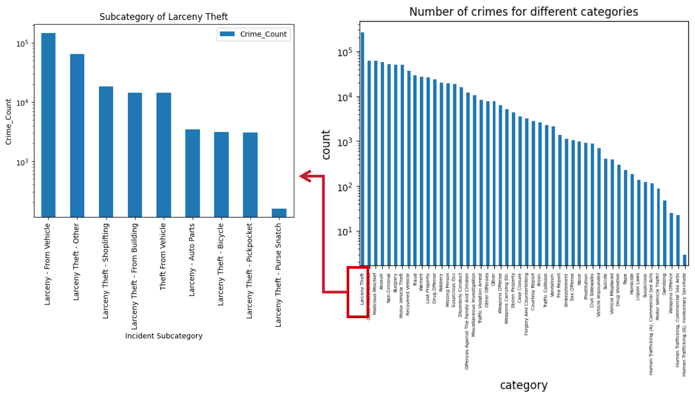
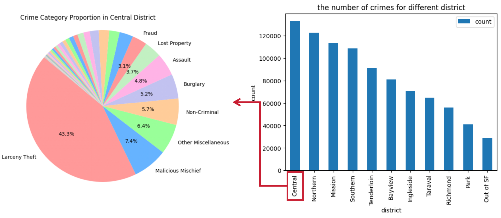
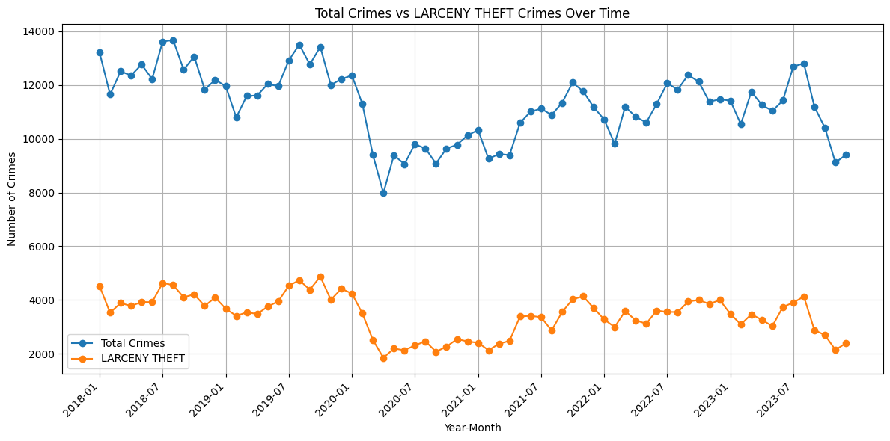

# 🏙 Socioeconomic Drivers of Crime in San Francisco

This repository hosts an econometric and forecasting study on how socioeconomic factors relate to crime patterns in San Francisco.

Using **~913k incident-level crime records** linked to **ACS census-tract panel data (2017–2022)**, the project builds a pipeline capable of:

- Spatially joining police incident records to census tracts  
- Constructing a tract–year longitudinal panel  
- Estimating fixed-effects & count models for crime rates  
- Exploring temporal structure with ARIMAX/SARIMAX-style forecasting

> ⚠️ Note: Some initial data utilities were based on course-provided starter code.  
> This repo highlights my contributions to panel construction, modeling design, interpretation, and visualization.
---

## 💡 Research Question

> *Is crime “about the economy”?*  
> Specifically: how do unemployment, inequality, mobility, and education relate to crime trends across space and time?

---

## 🧱 Data & Construction

### **📍 Crime Data — SF Open Data Portal**
- ~913,732 incident-level records
- Fields include location, timestamp, offense type, resolution

### **📍 Socioeconomic Data — ACS (Census Bureau)**
- 5-year estimates at census tract level
- Variables: income, education, transit usage, inequality (Gini), race, etc.

### **🔧 Key Engineering Steps**
- Convert incidents to GeoDataFrame → **spatial join to census tracts**
- Aggregate to `tract × year` panel  
- Derived features:
  - Δ crime rates
  - mobility & density
  - COVID-era indicators
  - population-weighted metrics

---

## 📊 Methods

| Analytical Goal | Method |
|----------------|--------|
| Spatial aggregation | geopandas + shapely |
| Panel inference | Fixed-effects models (tract FE, year FE) |
| Count outcomes | Poisson / Negative Binomial |
| Time structure | ARIMAX / SARIMAX |
| Visualization | matplotlib / seaborn |

---

## 🔍 Key Findings (High-Level)

- Transit usage & mobility → **strong positive association** with crime
- Unemployment & inequality → **sign flip when mobility controlled** (spatial sorting)
- Education reduces violent/public order crime but **raises reported property crime**
- COVID era → **public order ↓, property crime ↑**

These are **model-based associations**, not causal claims.

---

## 📈 Visual Highlights

### 🔹 Crime Volume by Category


Larceny Theft dominates overall incidents → motivates subcategory decomposition.

---

### 🔹 Crime Distribution by District


Concentration in Central, Tenderloin, Mission aligns with mobility & density patterns.

---

### 🔹 Time Trend: Total vs Larceny Theft


COVID shock created structural breaks relevant for forecasting.

---

## 🧩 Why This Matters (Applied Analytics Perspective)

This project illustrates:

- **Large-scale data → coherent analytical pipeline**
- Choosing correct models for **over-dispersed longitudinal count data**
- Distinguishing **individual prediction vs aggregate inference**
- Presenting results in a **decision-oriented format**

These skills transfer to:

- demand forecasting  
- branch performance + mobility analysis  
- resource allocation in public & private sectors  
- data products combining spatial + temporal signals

---

## 📁 Repository Structure

```text
.
├── notebooks/
│   ├── 01_preprocessing.ipynb
│   └── analysis.pdf
├── report/
│   ├── Socioeconomic_Attributes_and_Crime.pdf
│   └── paper.tex
├── assets/
│   └── figures/
│       ├── fig_category_distribution.png
│       ├── fig_district_comparison.png
│       └── fig_time_trend.png
├── data/
│   └── README_DATA.md
└── env/
    └── requirements.txt

Raw datasets not included due to size and licensing.

---

## 🛠 Tech Stack

**Languages & Analysis**  
Python, pandas, numpy  

**Spatial & Aggregation**  
geopandas, shapely  

**Modeling & Visualization**  
statsmodels, matplotlib, seaborn

---

## 📎 Acknowledgements

Crime data: San Francisco Open Data Portal  
Socioeconomic data: U.S. Census Bureau, American Community Survey (ACS)  
